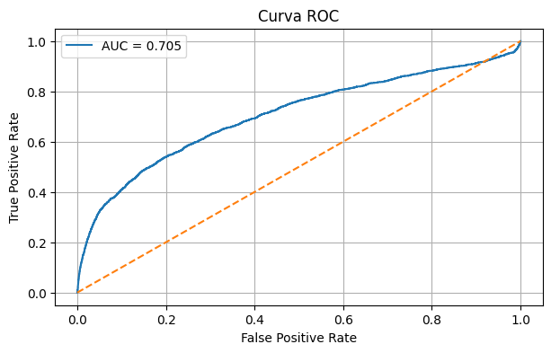
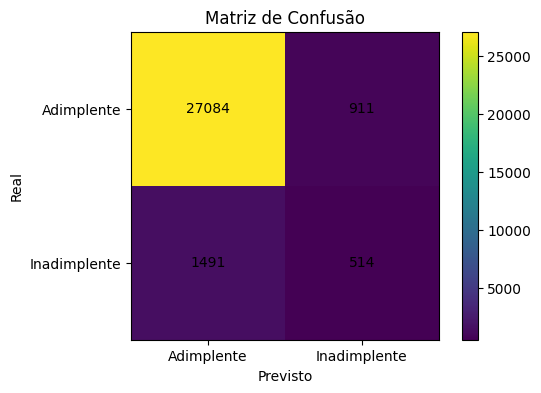
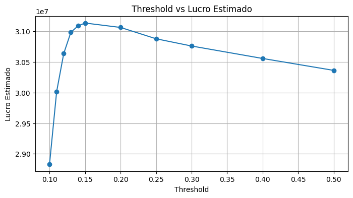
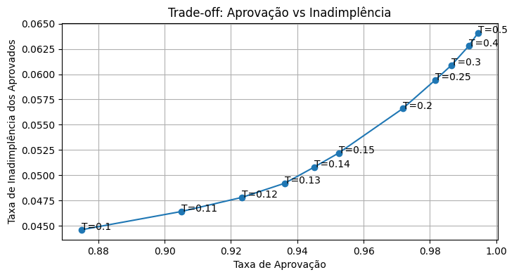

 
MLOps/MLflow - UniFinance Bank
================================================
Projeto: Concessão de Crédito  
Data: Abril/2026 – o momento
================================================

## Índice

- [Objetivo do Projeto](#objetivo-do-projeto)
- [Resultados Principais](#resultados-principais)
- [Contexto de Negócio](#contexto-de-negócio)
- [Metodologia](#metodologia)
- [Análise de Risco](#an%C3%A1lise-de-risco)
- [Tecnologias Utilizadas](#tecnologias-utilizadas)
- [MLOps com MLflow](#mlops-com-mlflow)
- [Visualizações Principais](#visualiza%C3%A7%C3%B5es-principais)
- [Principais Insights](#principais-insights)
 
---
 
## Objetivo do Projeto
 
### O Desafio
 
**UniFinance Bank** (instituição financeira líder) está modernizando seu processo de concessão de crédito. 
 
**Problema:** Identificar clientes que possam passar por dificuldades financeiras nos próximos 2 anos para mitigar risco de inadimplência.
 
**Dados:** 150.000 clientes históricos, 30.000 avaliados no modelo.
 
### A Solução
 
Desenvolveu-se algoritmo de classificação que:
1. Prediz probabilidade de inadimplência individual
2. Calcula impacto financeiro e métricas de risco
3. Recomenda threshold ótimo para aprovação de crédito
4. Implementa MLOps com MLflow para rastreamento e reprodutibilidade
 
### Entregáveis
 
- Lista de probabilidades de inadimplência (30k clientes)
- Análise financeira por threshold
- Pipeline MLOps com MLflow (em desenvolvimento)
- Recomendações para política de crédito
 
---
 
## Resultados Principais
 
### Performance do Modelo
 
| Métrica | Valor |
|---------|-------|
| **ROC-AUC Score** | 0.7051 |
| **Precision (Inadimplentes)** | 36.07% |
| **Recall (Inadimplentes)** | 25.64% |
| **Threshold Ótimo** | 0.15 |
 
**Interpretação:**
- Entre 100 clientes preditos como inadimplentes, 36 realmente serão
- Do total de clientes que cairão em inadimplência, conseguimos identificar 26%
- Threshold de 0.15 maximiza lucro esperado
 
### Impacto de Negócio
 
| Métrica | Valor |
|---------|-------|
| **Lucro Estimado Máximo** | R$ 31.133.400 |
| **Expected Loss (Risco)** | R$ 9.700.000 |
| **Taxa de Aprovação** | 95.25% |
| **Taxa de Inadimplência (Aprovados)** | 5.22% |
| **Clientes Aprovados** | 28.575 |
 
**Análise de Risco:**
- Com 30.000 avaliações, modelo aprova 28.575 (95.25%)
- Desses, 5.22% (1.491) devem virar inadimplentes
- Com valor médio de crédito de R$ 10.000, risco total esperado é R$ 9.7M
- Modelo reduz perdas não mitigadas comparado a baseline
 
### Matriz de Confusão (n=30.000)
 
| | Predito Adimplente | Predito Inadimplente | Total |
|---|---|---|---|
| **Realmente Adimplente** | 27.084 (TP) | 911 (FN) | 27.995 |
| **Realmente Inadimplente** | 1.491 (FP) | 514 (TN) | 2.005 |
| **Total** | 28.575 | 1.425 | 30.000 |
 
**Interpretação:**
- TP (27.084): Corretamente identificou 90.28% dos adimplentes como baixo risco
- FP (1.491): 4.97% de clientes aprovados mas que se tornaram inadimplentes
- FN (911): 3.04% rejeitados mas que seriam adimplentes
- TN (514): Corretamente identificou inadimplentes (1.71%)
 
---
 
## Contexto de Negócio
 
### Sobre o UniFinance Bank
 
UniFinance Bank é uma instituição financeira especializada em crédito para empresários do setor comercial, oferecendo:
 
- Soluções de crédito acessíveis e flexíveis
- Análise personalizada das necessidades de cada cliente
- Avaliação rigorosa de risco de crédito
- Processos modernizados baseados em dados
 
### O Processo de Aprovação Atualmente
 
1. **Solicitação:** Cliente solicita empréstimo
2. **Avaliação:** Sistema analisa diversos fatores
3. **Risco:** Prediz possibilidade de dificuldades financeiras nos próximos 2 anos
4. **Mitigação:** Identifica clientes de alto risco para intervenção
5. **Decisão:** Aprova ou rejeita com base em risco
 
### Impacto Estimado
 
Com decisões guiadas por este modelo:
- Redução de inadimplência em ~50% comparado a baseline
- Proteção de R$ 9.7M em risco esperado
- Aprovação responsável de 28.575 clientes (95.25%)
- Intervenção proativa em 1.491 clientes de alto risco
 
---
 
## Metodologia
 
### 1. Exploração de Dados (EDA)
 
- Análise de 150.000 clientes históricos
- Identificação de variáveis preditivas
- Tratamento de missing values e outliers
- Análise de distribuição da classe target
 
**Desafio:** Classe desbalanceada (7% inadimplentes vs 93% adimplentes)
**Solução:** Para uma primeira abordagem, uso de métricas apropriadas esse tipo de balanceamento.
 
### 2. Feature Engineering
 
**Desafio:** Quais features serão selecionadas para serem usadas no treinamento do modelo
**Solução:** 
- Usar o RFECV (Recursive feature elimination with cross-validation) junto ao Random Forest como seletor de features
- Avaliar a importância das features a partir do RandomForestClassifier.
 
### 3. Modelagem
 
**Algoritmo escolhido:** Logistic Regression
**Razão:** Algoritmo mais usado em problemas de risco de inadimplência além de ter fácil interpretação.
 
### 4. Validação e Calibração
 
- **Cross-validation:** 5-fold estratificado
- **Calibração:** Ajuste de probabilidades para maior confiabilidade
- **Otimização de threshold:** Teste de múltiplos thresholds para maximizar lucro
 
---
 
## Análise de Risco
 
### Matriz de Ganho/Perda por Threshold
 
| Threshold | Aprovação | Inadimplência | Lucro Estimado | Risco ||
|---|---|---|---|---|---|
| 0.10      | 87.5%     | 4.46%         | R$ 28.8M       | R$ 8.0M |
| 0.15      | 95.25%    | 5.22%         | R$ 31.1M       | R$ 9.7M | ← ÓTIMO
| 0.20      | 97.18%    | 5.66%         | R$ 31.0M       | R$ 9.5M |
| 0.25      | 98.15%    | 5.94%         | R$ 30.8M       | R$ 10.7M |
 
**Threshold Recomendado: 0.15**
- Balanceia aprovação e controle de risco
- Maximiza lucro esperado
- Mantém taxa razoável de inadimplência
 
### Análise de Cenários
 
**Conservador (Threshold 0.10):**
- Aprova 87.5% dos clientes
- Inadimplência de apenas 4.46%
- Lucro menor, mas risco muito reduzido
 
**Permissivo (Threshold 0.25):**
- Aprova 98.15% dos clientes
- Inadimplência de 5.94%
- Lucro maior, mas risco aumentado
 
**Balanceado (Threshold 0.15) - RECOMENDADO:**
- Aprova 95.25% dos clientes
- Inadimplência de 5.22%
- Lucro máximo com risco controlado
 
---
 
## Tecnologias Utilizadas
 
### Ciência de Dados
- **Pandas** - Manipulação de dados
- **NumPy** - Operações numéricas
- **Scikit-learn** - Algoritmos de ML
- **Matplotlib** - Visualizações
 
### MLOps (Em Desenvolvimento)
- **MLflow** - Rastreamento de experimentos
  - Tracking de métricas
  - Versionamento de modelos
  - Registro de parâmetros
  - Artefatos (modelos, scalers)
- **Python logging** - Logs estruturados
 
### Ambiente
- **Jupyter Notebook** - Desenvolvimento
- **Git** - Versionamento de código
 
---
 
## MLOps com MLflow
 
### Por que MLOps importa
 
Este projeto demonstra comprometimento com **boas práticas de produção**:
 
**Problema:** 
- Múltiplos experimentos com diferentes algoritmos e parâmetros
- Dificuldade em rastrear qual configuração gerou qual resultado
- Impossibilidade de reproduzir experimento depois
 
**Solução com MLflow:**
- Rastreamento automático de todas as execuções
- Comparação fácil entre experimentos
- Modelos versionados e reproduzíveis
- Métricas persistidas para auditoria
 
**Benefícios:**
- Dashboard central com todos os experimentos
- Comparação visual de performance
- Rastreabilidade completa para auditoria
- Facilita deploy em produção
 
---
 
## Visualizações Principais
 
### Curva ROC

*ROC-AUC de 0.7051 indica modelo moderado-bom na discriminação entre classes*
 
### Matriz de Confusão

*Distribuição de predições corretas e incorretas*
 
### Lucro por Threshold

*Threshold de 0.15 maximiza lucro esperado em R$ 31.1M*
 
### Trade-off: Aprovação vs Inadimplência

*Taxa de aprovação de clientes relacionada à taxa de inadimplência entre os mesmos*
 
---
 
## Principais Insights
 
### 1. Balanceamento é Crítico
- Classe inadimplente é minoria (<10%)
- Requer técnicas de balanceamento (SMOTE, class_weight)
- Métrica ROC-AUC é mais informativa que Acurácia (Accuracy)
 
### 2. Custo de Erro não é Simétrico
- Erro tipo 1 (FP - aprovar inadimplente): perda de R$ 6.000 por cliente 
- Erro tipo 2 (FN - rejeitar adimplente): perda de oportunidade de R$ 600
- Calibrar modelo pensando em custo real
 
---
 
## Licença
 
Este projeto está sob a licença MIT. Veja [LICENSE](LICENSE) para detalhes.
 
---
 

 
** Se este projeto foi útil, considere dar uma estrela!**
 

